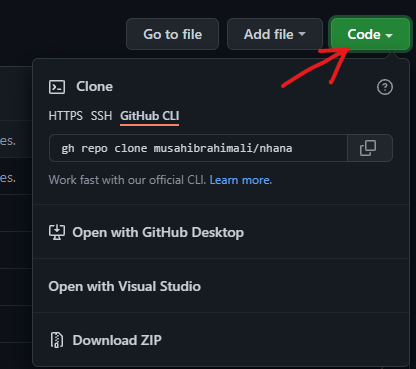

# nhana
some demo c++ code

## Instructions

# Geting the code on your machine
- click on code on the github page of this repository

- clone or download as zip

- unzip the zipped file on your machine and ...

# next set of instructions

- to use this program make sure to read the comments in the code
- make sure visual studio 2019 or earlier is install on your system along with c++ dev dependencies
- open https://github.com/musahibrahimali/nhana/blob/master/nhana.sln file by either selecting open fron the lauch screen of visual studio or simply by double clicking the nhana.sln file to open in visual studio code.
